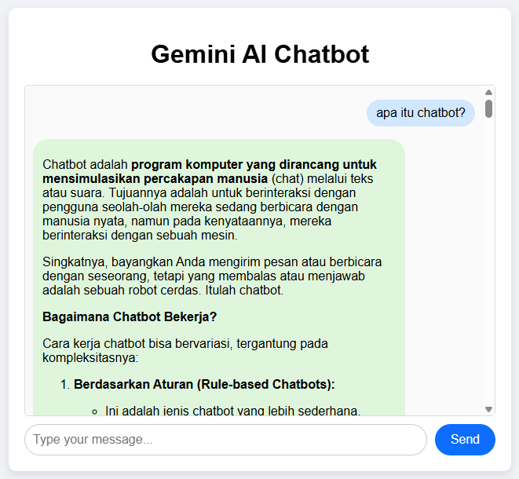

# **AI Chatbot dengan Google Gemini API**

Aplikasi web chatbot sederhana yang ditenagai oleh Google Gemini API, dibangun menggunakan Node.js/Express untuk backend dan Vanilla JavaScript untuk frontend.

Aplikasi ini menyediakan antarmuka obrolan yang bersih dan interaktif, memungkinkan pengguna untuk mengajukan pertanyaan dan menerima respons cerdas yang dihasilkan oleh model AI canggih dari Google.
<div align="center">
    
</div>

## **Daftar Isi**

* <a href="#fitur-utama">Fitur Utama</a>
* <a href="#teknologi">Teknologi</a> 
* <a href="#arsitektur">Arsitektur</a>  
* <a href="#instalasi-dan-penggunaan">Instalasi dan Penggunaan</a> 
* <a href="#spesifikasi-api">Spesifikasi API</a>   

## **Fitur Utama**

* **Respons AI Cerdas**: Terintegrasi dengan Google Gemini API untuk memberikan jawaban yang relevan dan kontekstual.  
* **Antarmuka Interaktif**: Pengalaman obrolan *real-time* yang mulus tanpa perlu me-refresh halaman.  
* **Dukungan Penuh Markdown**: Mampu merender format teks dari AI, seperti tebal, miring, daftar, blok kode, tautan, dan lainnya.  
* **Indikator Status**: Memberikan umpan balik visual kepada pengguna saat AI sedang memproses permintaan ("Thinking...").  
* **Ringan dan Cepat**: Dibangun dengan Vanilla JavaScript di sisi frontend untuk memastikan performa yang optimal dan tanpa ketergantungan pada *framework* eksternal.

## **Teknologi**

* **Backend**:  
  * [Node.js](https://nodejs.org/)  
  * [Express.js](https://expressjs.com/)  
* **Frontend**:  
  * HTML5  
  * CSS3  
  * Vanilla JavaScript (ES6+)  
* **API Eksternal**:  
  * Google Gemini API

## **Arsitektur**

Aplikasi ini menggunakan arsitektur *client-server* sederhana:

* **Frontend (Client)**: Berjalan di browser pengguna, bertanggung jawab untuk menampilkan antarmuka obrolan dan mengirim input pengguna ke backend.  
* **Backend (Server)**: Bertindak sebagai perantara yang menerima permintaan dari frontend, berkomunikasi secara aman dengan Google Gemini API menggunakan API key, dan meneruskan respons kembali ke frontend.

## **Instalasi dan Penggunaan**

Untuk menjalankan proyek ini di lingkungan lokal Anda, ikuti langkah-langkah berikut.

### **Prasyarat**

* [Node.js](https://nodejs.org/en/download/) (disarankan versi 18.x atau lebih baru)  
* npm (biasanya terinstal bersama Node.js)  
* API Key untuk Google Gemini

### **Langkah-langkah**

1. **Clone Repositori**  
   ```
   git clone <URL_REPOSITORI_ANDA>  
   cd <NAMA_FOLDER_PROYEK>
   ```

2. **Konfigurasi Backend**  
   * Pindah ke direktori backend (jika ada, jika tidak, lakukan di root proyek).  
   * Install semua dependensi yang diperlukan:  
     ```
     npm install
     ```

   * Buat file baru bernama .env di direktori backend dan tambahkan API key Anda:  
     ```
     GEMINI_API_KEY="MASUKKAN_KUNCI_API_ANDA_DI_SINI"
     ```

   * Jalankan server backend:  
     ```
     node server.js
     ```

Server sekarang akan berjalan di http://localhost:3000 (atau port yang Anda konfigurasikan).

3. **Jalankan Frontend**  
   * Buka file index.html yang berada di direktori frontend (atau root) langsung di browser web pilihan Anda.  
   * Mulai mengobrol dengan AI\!

## **Spesifikasi API**

Backend menyediakan satu endpoint utama untuk memfasilitasi komunikasi antara frontend dan Gemini API.

### **POST /api/chat**

Endpoint ini menerima pesan dari pengguna, meneruskannya ke Gemini, dan mengembalikan respons yang dihasilkan oleh AI.

**Request Body:**
```
{  
  "messages": [  
    {  
      "role": "user",  
      "content": "Ceritakan tentang sejarah Indonesia."  
    }  
  ]  
}
```
**Response Body (Sukses):**
```
{  
  "result": "Tentu, sejarah Indonesia adalah topik yang sangat luas dan menarik\! Dimulai dari..."  
}  
```
